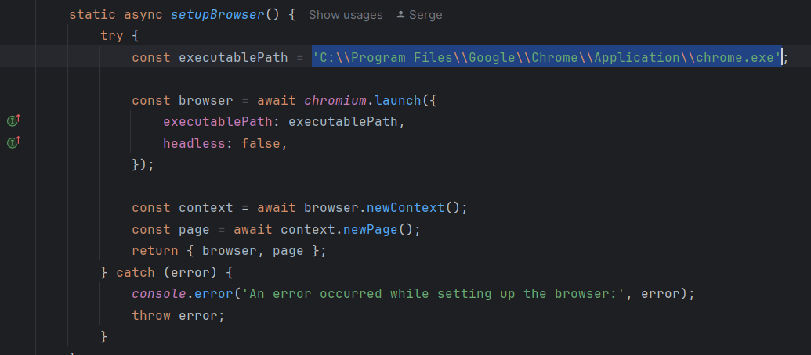

# Playwright Login Automation

## Overview
This project provides automated tests for the login flow of Engenious University using Playwright and Vitest. It leverages the Page Object Model (POM) pattern for better maintainability and readability of the code.

## Features
- Automates login testing using Playwright.
- Uses the Page Object Model to separate page structure, actions, and test steps.

## Setup
1. Clone the repository.
   ```bash
   git clone https://github.com/seeyoucyberspace/Playwright_Login_Automation.git
   ```
2. Install dependencies.
   ```bash
   npm install
   ```

## Running Tests
- To run tests with UI:
  ```bash
  npm run test
  ```

## Project Structure
- `config/`: Configuration files for credentials, URLs, and browser settings.
- `pages/`: Page objects representing the application UI.
- `actions/`: Low-level actions interacting with page elements.
- `steps/`: Higher-level steps for user actions.
- `utils/`: Utility functions and custom error classes.
- `specs/`: Test specifications.

## Dependencies
- [Playwright](https://playwright.dev/): Used for browser automation.
- [Vitest](https://vitest.dev/): Used for running tests.

## Troubleshooting
- If you are experiencing an error with launching the Chrome browser on your local machine, please try changing the Chrome browser path to the one that is relevant to you.
  The path can be changed in the `utils/` folder, in the `BrowserUtils.ts` file, as shown in the screenshot below:
- 
